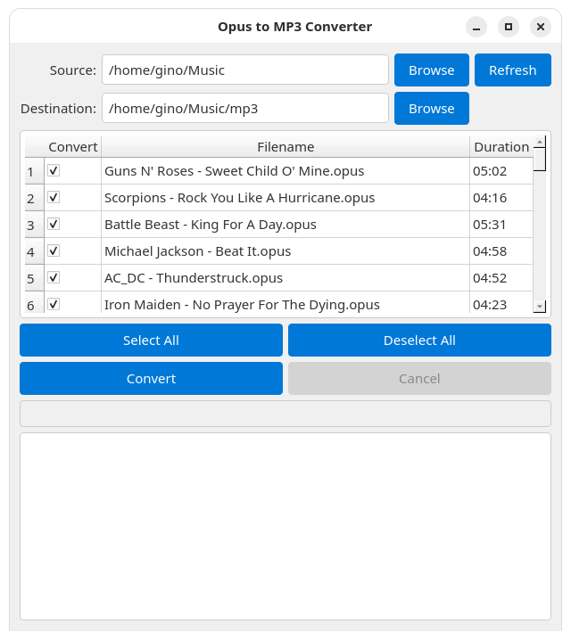

# opus2mp3
GUI application that converts Opus audio files to MP3 format.

This script provides a user-friendly graphical interface for converting Opus audio files (.opus) into the more widely compatible MP3 format. It's designed for simplicity and efficiency, allowing users to easily select Opus files, convert them, and save them as MP3s with just a few clicks. The application handles the underlying conversion process, making it accessible even for users who are not familiar with command-line tools.

Key Features:
- **Batch Conversion:** Convert multiple Opus files to MP3 simultaneously.
- **Intuitive GUI:** Easy-to-use interface for selecting files and managing conversions.
- **Progress Tracking:** Monitor the conversion progress of each file.
- **Error Handling:** Provides feedback on any conversion failures.

How it Works:
The application leverages external libraries to perform the audio conversion. When you select Opus files and initiate the conversion, the script processes each file, transcodes the audio data from Opus to MP3, and saves the new MP3 files to your specified output directory.

